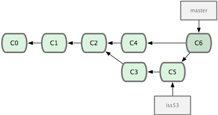
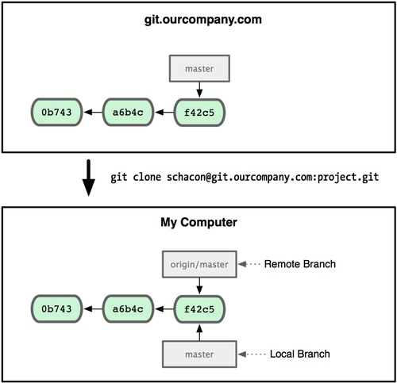

!SLIDE center transition=uncover
# GIT

!SLIDE smbullets transition=uncover
# Características

* Snapshots, no diferencias
* Casi todas las operaciones son locales
* Tiene integridad

!SLIDE smbullets transition=uncover
# Los 3 estados

* Working directory
* Staging area
* Git directory (Repositorio)

!SLIDE transition=uncover
# Operaciones locales


!SLIDE smbullets transition=uncover
# Obteniendo un repositorio git

* Iniciarlizar un repositorio en un directorio existente

```
$ git init
```

* Clonando un repositorio existente

```
$ git clone https://github.com/rails/rails.git
```

!SLIDE transition=uncover
# Ciclo de vida de un archivo


!SLIDE smbullets transition=uncover
# Remotos

* Son repositorios externos (ejemplo: de coworkers).
* Puede haber n remotos

!SLIDE smbullets transition=uncover
# ¿Qué es un branch?

* Es un puntero a un commit


!SLIDE smbullets transition=uncover
# ¿Y cómo sabe git en que branch estamos actualmente?

* Otro puntero: HEAD


!SLIDE smbullets transition=uncover
# Cambiando de branch

```
$ git checkout testing
```


* Lo único que hace es cambiar HEAD!

!SLIDE smbullets transition=uncover
# Haciendo cambios en un branch

```
$ vi test.rb
```

```
$ git commit -am 'made a change'
```


!SLIDE smbullets transition=uncover
# Volviendo a master

```
$ git checkout master
```


!SLIDE smbullets transition=uncover
# Haciendo cambios en master

```
$ vi test.rb
```

```
$ git commit -am 'made other changes'
```


!SLIDE smbullets transition=uncover
# Branching y merging


!SLIDE smbullets transition=uncover
# Branching y merging


!SLIDE smbullets transition=uncover
# Branching y merging


!SLIDE smbullets transition=uncover
# Branching y merging


!SLIDE smbullets transition=uncover
# Branching y merging: fast-forward

```
$ git checkout master
```

```
$ git merge hotfix
```


!SLIDE smbullets transition=uncover
# Branching y merging


!SLIDE smbullets transition=uncover
# Branching y merging: merge made by recursive

```
$ git checkout master
```

```
$ git merge iss53
```


!SLIDE smbullets transition=uncover
# Branching y merging



!SLIDE smbullets transition=uncover
# Merge: Conflictos

* Remotos



!SLIDE smbullets transition=uncover
# Merge: Conflictos


!SLIDE smbullets transition=uncover
# Merge: Conflictos


!SLIDE smbullets transition=uncover
# Merge: rebasing

* Tomar un patch del cambio y re-aplicarlo en otro branch


!SLIDE smbullets transition=uncover
# Merge: rebasing

```
$ git checkout experiment
```

```
$ git rebase master
```


!SLIDE smbullets transition=uncover
# Merge: rebasing


!SLIDE smbullets transition=uncover
# Merge: rebasing

* La historia es más limpia
* Simula una historia lineal
